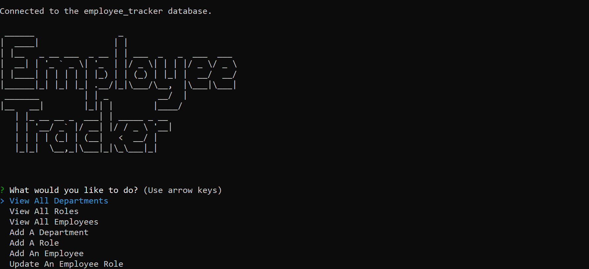

# Employee Tracker


[](https://choosealicense.com/licenses/mit/)

## Description
A tracker app that allows the user to view and manage their business's departments, roles, and employees so that they can organize and plan their company.



## Table of Contents
* [Demo](#demo)
* [Installation](#installation)
* [Usage](#usage)
* [Queries](#queries)
* [License](#license)
* [Questions](#questions)

## Demo
[Click here](https://drive.google.com/file/d/14z6HRPoWoNxQNTJVMgHnGCEFXSu2Ps8f/view) to watch a demo of the application.

## Installation
1. Install [Node.js](https://nodejs.org/en/) and [MySQL](https://dev.mysql.com/downloads/mysql) if you haven't already.
    - You can follow this [installation guide](https://coding-boot-camp.github.io/full-stack/mysql/mysql-installation-guide) to help you install MySQL.
2. Clone this repository onto your computer.
3. Navigate to the root of this repository on the command line.
4. Run `npm install` on the command line.
5. Run the following commands on the command line one at a time to install the necessary packages:
```
npm install express;
npm install --save mysql2;
npm install console.table --save;
```
6. Run `mysql -u root -p` on the command line to open the MySQL interface.
7. In MySQL, run the following commands one at a time to set up the `employee_tracker` database:
```
SOURCE ./db/db.sql;
SOURCE ./db/schema.sql;
SOURCE ./db/seeds.sql;
```

## Usage
1. Navigate to the root directory of this repository.
2. Run `npm start` on the command line.
3. Answer the prompts to manage departments, roles, and/or employees.

## Queries
This application utilizes multiple queries:
- `SELECT` to display the different tables for Departments, Roles, and Employees.
- `JOIN` to join multiple tables together in order to display all the necessary information in a single table.
- `INSERT INTO` to add a new department, role, or employee.
- `UPDATE` to update the record for an employee.

## License
Licensed under the [MIT](https://choosealicense.com/licenses/mit/) license.

## Questions
- [GitHub](https://github.com/kg-phantom)